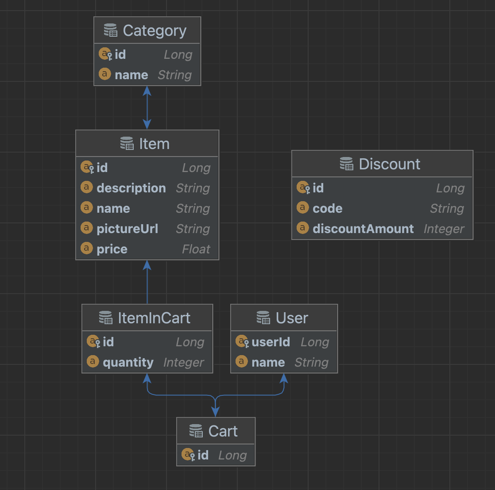

# Emporium Shopping

### Website link
[https://emporium-shopping.netlify.app/](https://emporium-shopping.netlify.app/)

## Description

Emporium Shopping is a website that lets you add items to a cart from an existing database of items
and view your subtotal and total including tax.

### API Docs
https://emporium-shopping.herokuapp.com/api/docs.

## Tech Stack

#### Backend
- Java
- Spring Boot
  - Spring Data JPA
  - Hibernate
  - Spring Web
- JUnit
  - Mockito

#### Frontend
- React
- Typescript
- TailwindCSS

#### Database
- PostgreSQL

#### Deployment
- Heroku (backend)
- Netlify (frontend)
- Docker
- GitHub Actions (CI/CD)

## Database Schema Diagram

 
 

Created by Uthman Mohamed and Nathan Raymant